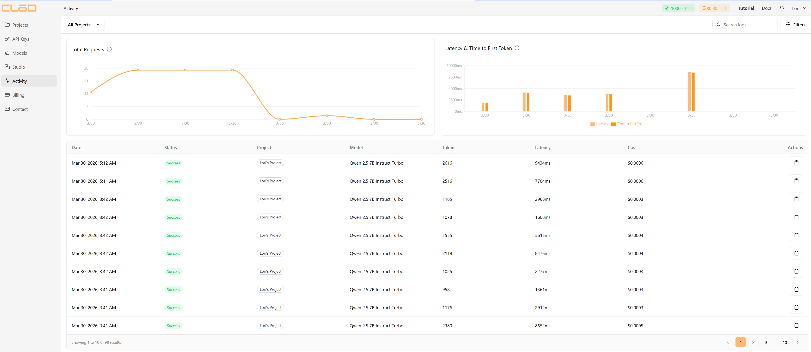
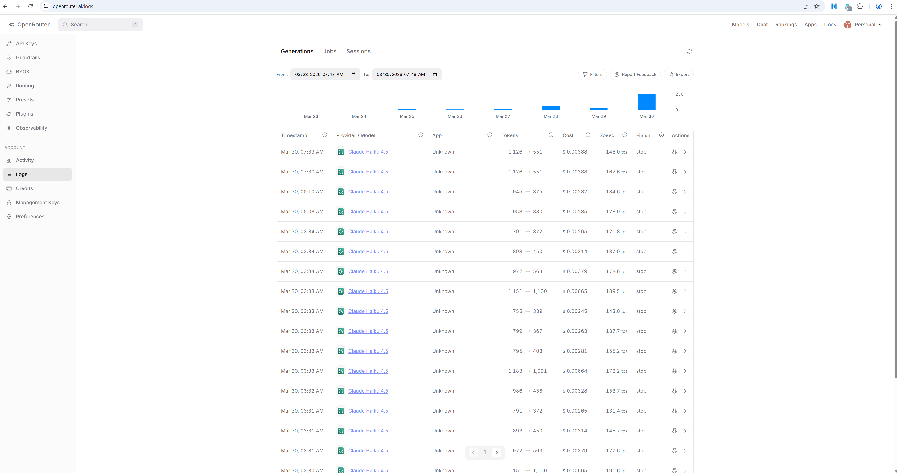
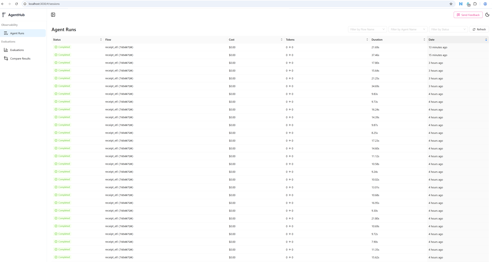

# GatherYourDeals ETL — Baseline Experiment Report
_Generated: 2026-03-30 13:01 UTC_

## Summary

Baseline egress measurement for the ETL pipeline across all provider dependencies. 9 receipts processed through Azure Document Intelligence (OCR) and 2 LLM provider(s).

This experiment is intentionally sequential and quality-focused — not a concurrency stress test. LLM providers impose per-token costs and rate limits that make concurrent load testing inappropriate and expensive for this component. The right lens for LLM evaluation is test case quality and cost-per-call, not infrastructure throughput. Concurrency stress testing belongs to the data service layer, where requests are cheap and the bottleneck is server resources.

## Metrics Gathered

The following metrics are collected per receipt per provider to evaluate quality, latency, and cost:

| Metric | Source | Purpose |
|--------|--------|---------|
| E2E P50 / P95 latency (ms) | `pipeline_complete` | True wall time from image in to JSON out |
| LLM P50 / P95 latency (ms) | `llm_extraction` | Egress round-trip to LLM provider |
| ADI P50 / P95 latency (ms) | `adi_ocr` | Egress round-trip to Azure Document Intelligence |
| Input / output tokens | `llm_extraction` | Payload size — explains latency and cost variance |
| Cost per receipt (USD) | `llm_extraction` | Real billed cost or token-based estimate |
| Failure rate | `llm_extraction` | Provider reliability — failed calls / total calls |
| Throughput (receipts/min) | Derived from E2E P50 | Sustained processing capacity |
| Items extracted | `llm_extraction` | Output correctness proxy — expected vs actual count |
| Field-level accuracy (0–100%) | `--eval` | Per-field scoring: store, date, price, item name/price match |

## Repeated Trials

Each receipt was processed multiple times per provider (~3 runs) to account for variability in:

- Network latency
- OCR processing time
- LLM response time

This increases the number of observations from 9 to ~27 per provider, improving the reliability of latency and cost estimates.

Per-receipt entries shown in the report include repeated runs to capture this variance, while summary metrics (P50, P95, averages) are computed across all runs.

## Environment

| Setting | Value |
|---------|-------|
| Platform | Local (WSL2) |
| Date | 2026-03-30 |
| Receipts tested | 9 |
| Ground truth available | 9 receipts |
| OCR provider | Azure Document Intelligence (prebuilt-read, F0 free tier) |
| LLM provider | clod / Qwen2.5-7B-Instruct-Turbo |
| LLM provider | openrouter / claude-haiku-4.5 |

## OCR Provider — Azure Document Intelligence

| Metric | Value |
|--------|-------|
| Calls | 54 (54 success) |
| Avg latency | 5,968 ms |
| P50 latency | 5,173 ms |
| P95 latency | 11,805 ms |
| Avg OCR chars extracted | 771 |
| Estimated cost | $0.0810 (F0 free tier — 500 pages/month) |

## LLM Provider Comparison

| Provider | Model | Receipts | Fail rate | E2E P50 (ms) | E2E P95 (ms) | Throughput | LLM P50 (ms) | LLM P95 (ms) | Avg lat (ms) | Avg in tok | Avg out tok | Cost/receipt | Total cost | Item count match |
|----------|-------|:--------:|:---------:|-------------:|-------------:|:----------:|-------------:|-------------:|-------------:|-----------:|------------:|-------------:|:----------:|:----------------:|
| clod | Qwen2.5-7B-Instruct-Turbo | 9 | 0/27 (0%) | 10,256 | 16,965 | ~6/min | 3,509 | 9,242 | 4,666 | 918 | 483 | $0.0003 | $0.0090 | 7/9 |
| openrouter | claude-haiku-4.5 | 9 | 0/27 (0%) | 13,078 | 22,111 | ~5/min | 3,718 | 10,080 | 4,977 | 925 | 572 | $0.0038 | $0.1021 | 8/9 |

_Item count match: a receipt is counted as correct if the most common (modal) item count across all runs equals the ground-truth count._

## Per-Receipt Breakdown

| Receipt | OCR chars | ADI (ms) | Provider | Model | In tok | Out tok | Cost | LLM (ms) | Items extracted | Items expected | API |
|---------|----------:|---------:|----------|-------|-------:|--------:|-----:|---------:|----------------:|:--------------:|:---:|
| 2026-01-01RealCanadianSuperstore.jpg | 811 | 5289 | openrouter | claude-haiku-4.5 | 986 | 458 | $0.003276 | 10080 | 3 | ✓ | ✓ |
| 2026-01-03Costco.jpg | 1191 | 5032 | openrouter | claude-haiku-4.5 | 1,183 | 1,093 | $0.006648 | 6776 | 14 | ✗ | ✓ |
| 2026-01-22Independent.jpg | 585 | 5407 | openrouter | claude-haiku-4.5 | 795 | 403 | $0.002810 | 3567 | 2 | ✓ | ✓ |
| 2026-02-10Independent.jpg | 610 | 8997 | openrouter | claude-haiku-4.5 | 799 | 367 | $0.002634 | 3442 | 1 | ✓ | ✓ |
| 2026-02-10Kin's.jpg | 501 | 5867 | openrouter | claude-haiku-4.5 | 755 | 339 | $0.002450 | 3073 | 1 | ✓ | ✓ |
| 2026-02-14T&T.jpg | 911 | 4778 | openrouter | claude-haiku-4.5 | 1,151 | 1,100 | $0.006651 | 6588 | 14 | ✓ | ✓ |
| 2026-02-28Ralphs.jpg | 930 | 5041 | openrouter | claude-haiku-4.5 | 972 | 563 | $0.003787 | 3617 | 4 | ✓ | ✓ |
| 2026-03-04Independent.jpg | 824 | 5186 | openrouter | claude-haiku-4.5 | 893 | 450 | $0.003143 | 3528 | 1 | ✓ | ✓ |
| 2026-03-08Independent.jpg | 580 | 5741 | openrouter | claude-haiku-4.5 | 791 | 372 | $0.002651 | 3214 | 1 | ✓ | ✓ |
| 2026-01-01RealCanadianSuperstore.jpg | 811 | 5065 | openrouter | claude-haiku-4.5 | 986 | 458 | $0.003276 | 10822 | 3 | ✓ | ✓ |
| 2026-01-03Costco.jpg | 1191 | 5010 | openrouter | claude-haiku-4.5 | 1,183 | 1,091 | $0.006638 | 6717 | 14 | ✗ | ✓ |
| 2026-01-22Independent.jpg | 585 | 5417 | openrouter | claude-haiku-4.5 | 795 | 403 | $0.002810 | 3289 | 2 | ✓ | ✓ |
| 2026-02-10Independent.jpg | 610 | 5336 | openrouter | claude-haiku-4.5 | 799 | 367 | $0.002634 | 3233 | 1 | ✓ | ✓ |
| 2026-02-10Kin's.jpg | 501 | 4913 | openrouter | claude-haiku-4.5 | 755 | 339 | $0.002450 | 3562 | 1 | ✓ | ✓ |
| 2026-02-14T&T.jpg | 911 | 4823 | openrouter | claude-haiku-4.5 | 1,151 | 1,100 | $0.006651 | 6370 | 14 | ✓ | ✓ |
| 2026-02-28Ralphs.jpg | 930 | 10029 | openrouter | claude-haiku-4.5 | 972 | 563 | $0.003787 | 4671 | 4 | ✓ | ✓ |
| 2026-03-04Independent.jpg | 824 | 5118 | openrouter | claude-haiku-4.5 | 893 | 450 | $0.003143 | 3805 | 1 | ✓ | ✓ |
| 2026-03-08Independent.jpg | 580 | 5980 | openrouter | claude-haiku-4.5 | 791 | 372 | $0.002651 | 3576 | 1 | ✓ | ✓ |
| 2026-01-01RealCanadianSuperstore.jpg | 811 | 5148 | openrouter | claude-haiku-4.5 | 986 | 458 | $0.003276 | 10042 | 3 | ✓ | ✓ |
| 2026-01-03Costco.jpg | 1191 | 5152 | openrouter | claude-haiku-4.5 | 1,183 | 1,091 | $0.006638 | 6905 | 14 | ✗ | ✓ |
| 2026-01-22Independent.jpg | 585 | 6666 | openrouter | claude-haiku-4.5 | 795 | 403 | $0.002810 | 3232 | 2 | ✓ | ✓ |
| 2026-02-10Independent.jpg | 610 | 5598 | openrouter | claude-haiku-4.5 | 799 | 367 | $0.002634 | 3284 | 1 | ✓ | ✓ |
| 2026-02-10Kin's.jpg | 501 | 4886 | openrouter | claude-haiku-4.5 | 755 | 339 | $0.002450 | 3346 | 1 | ✓ | ✓ |
| 2026-02-14T&T.jpg | 911 | 5918 | openrouter | claude-haiku-4.5 | 1,151 | 1,100 | $0.006651 | 6232 | 14 | ✓ | ✓ |
| 2026-02-28Ralphs.jpg | 930 | 5053 | openrouter | claude-haiku-4.5 | 972 | 563 | $0.003787 | 3784 | 4 | ✓ | ✓ |
| 2026-03-04Independent.jpg | 824 | 5019 | openrouter | claude-haiku-4.5 | 893 | 450 | $0.003143 | 3910 | 1 | ✓ | ✓ |
| 2026-03-08Independent.jpg | 580 | 6296 | openrouter | claude-haiku-4.5 | 791 | 372 | $0.002651 | 3718 | 1 | ✓ | ✓ |
| 2026-01-01RealCanadianSuperstore.jpg | 811 | 5104 | clod | Qwen2.5-7B-Instruct-Turbo | 962 | 259 | $0.000320 | 3305 | 2 | ✗ | ✓ |
| 2026-01-03Costco.jpg | 1191 | 5105 | clod | Qwen2.5-7B-Instruct-Turbo | 1,283 | 1,091 | $0.000516 | 9559 | 15 | ✓ | ✓ |
| 2026-01-22Independent.jpg | 585 | 5257 | clod | Qwen2.5-7B-Instruct-Turbo | 771 | 405 | $0.000280 | 4159 | 2 | ✓ | ✓ |
| 2026-02-10Independent.jpg | 610 | 5161 | clod | Qwen2.5-7B-Instruct-Turbo | 788 | 170 | $0.000257 | 2388 | 1 | ✓ | ✓ |
| 2026-02-10Kin's.jpg | 501 | 4964 | clod | Qwen2.5-7B-Instruct-Turbo | 729 | 294 | $0.000254 | 3414 | 1 | ✓ | ✓ |
| 2026-02-14T&T.jpg | 911 | 7640 | clod | Qwen2.5-7B-Instruct-Turbo | 1,082 | 1,037 | $0.000449 | 7725 | 14 | ✓ | ✓ |
| 2026-02-28Ralphs.jpg | 930 | 5081 | clod | Qwen2.5-7B-Instruct-Turbo | 961 | 490 | $0.000347 | 4867 | 3 | ✗ | ✓ |
| 2026-03-04Independent.jpg | 824 | 5126 | clod | Qwen2.5-7B-Instruct-Turbo | 895 | 183 | $0.000290 | 2306 | 1 | ✓ | ✓ |
| 2026-03-08Independent.jpg | 580 | 5459 | clod | Qwen2.5-7B-Instruct-Turbo | 793 | 392 | $0.000285 | 3980 | 1 | ✓ | ✓ |
| 2026-01-01RealCanadianSuperstore.jpg | 811 | 5035 | clod | Qwen2.5-7B-Instruct-Turbo | 962 | 259 | $0.000320 | 3192 | 2 | ✗ | ✓ |
| 2026-01-03Costco.jpg | 1191 | 11805 | clod | Qwen2.5-7B-Instruct-Turbo | 1,283 | 1,091 | $0.000516 | 8527 | 15 | ✓ | ✓ |
| 2026-01-22Independent.jpg | 585 | 5457 | clod | Qwen2.5-7B-Instruct-Turbo | 771 | 405 | $0.000280 | 3493 | 2 | ✓ | ✓ |
| 2026-02-10Independent.jpg | 610 | 13608 | clod | Qwen2.5-7B-Instruct-Turbo | 788 | 170 | $0.000257 | 2687 | 1 | ✓ | ✓ |
| 2026-02-10Kin's.jpg | 501 | 5516 | clod | Qwen2.5-7B-Instruct-Turbo | 729 | 296 | $0.000254 | 3460 | 1 | ✓ | ✓ |
| 2026-02-14T&T.jpg | 911 | 4830 | clod | Qwen2.5-7B-Instruct-Turbo | 1,082 | 1,023 | $0.000447 | 7901 | 14 | ✓ | ✓ |
| 2026-02-28Ralphs.jpg | 930 | 5122 | clod | Qwen2.5-7B-Instruct-Turbo | 961 | 461 | $0.000344 | 4618 | 3 | ✗ | ✓ |
| 2026-03-04Independent.jpg | 824 | 5139 | clod | Qwen2.5-7B-Instruct-Turbo | 895 | 183 | $0.000290 | 2340 | 1 | ✓ | ✓ |
| 2026-03-08Independent.jpg | 580 | 5950 | clod | Qwen2.5-7B-Instruct-Turbo | 793 | 408 | $0.000287 | 4306 | 1 | ✓ | ✓ |
| 2026-01-01RealCanadianSuperstore.jpg | 811 | 5056 | clod | Qwen2.5-7B-Instruct-Turbo | 962 | 259 | $0.000320 | 3280 | 2 | ✗ | ✓ |
| 2026-01-03Costco.jpg | 1191 | 5153 | clod | Qwen2.5-7B-Instruct-Turbo | 1,283 | 1,097 | $0.000517 | 9158 | 16 | ✗ | ✓ |
| 2026-01-22Independent.jpg | 585 | 11820 | clod | Qwen2.5-7B-Instruct-Turbo | 771 | 405 | $0.000280 | 3873 | 2 | ✓ | ✓ |
| 2026-02-10Independent.jpg | 610 | 5275 | clod | Qwen2.5-7B-Instruct-Turbo | 788 | 170 | $0.000257 | 2498 | 1 | ✓ | ✓ |
| 2026-02-10Kin's.jpg | 501 | 5021 | clod | Qwen2.5-7B-Instruct-Turbo | 729 | 296 | $0.000254 | 3112 | 1 | ✓ | ✓ |
| 2026-02-14T&T.jpg | 911 | 4895 | clod | Qwen2.5-7B-Instruct-Turbo | 1,082 | 1,037 | $0.000449 | 9242 | 14 | ✓ | ✓ |
| 2026-02-28Ralphs.jpg | 930 | 9643 | clod | Qwen2.5-7B-Instruct-Turbo | 961 | 594 | $0.000360 | 6312 | 3 | ✗ | ✓ |
| 2026-03-04Independent.jpg | 824 | 5244 | clod | Qwen2.5-7B-Instruct-Turbo | 895 | 183 | $0.000290 | 2766 | 1 | ✓ | ✓ |
| 2026-03-08Independent.jpg | 580 | 6020 | clod | Qwen2.5-7B-Instruct-Turbo | 793 | 392 | $0.000285 | 3509 | 1 | ✓ | ✓ |

## Cost

| Provider | Service | Cost |
|----------|---------|------|
| Azure | Document Intelligence (OCR) | $0.0810 (F0 free tier — logged at S0 rate) |
| clod | LLM (Qwen2.5-7B-Instruct-Turbo) | $0.0090 |
| openrouter | LLM (claude-haiku-4.5) | $0.1021 |
| **Total** | | **$0.1921** |

_openrouter costs are estimated from the published per-token rate card. clod costs are taken directly from the API response and reflect whatever rate structure the provider applies — individual figures cannot be independently verified from token counts alone._

## Findings

- **Lower E2E p50 latency:** clod / Qwen2.5-7B-Instruct-Turbo (10,256 ms vs 13,078 ms)
- **Throughput:** clod ~~6/min vs openrouter ~~5/min
- **Lower cost/receipt:** clod / Qwen2.5-7B-Instruct-Turbo ($0.0003)
- **Recommended primary:** clod / Qwen2.5-7B-Instruct-Turbo — lower egress latency
- **Recommended fallback:** openrouter / claude-haiku-4.5 — viable alternative if primary is unavailable

## Field-Level Accuracy

Scores each provider's output against ground_truth/ — field by field per receipt.
Outputs are saved to provider-specific directories (`output/<provider>/`) so each provider can be evaluated independently on the same receipts.
Scores are computed against all ground-truth items; unmatched slots count as misses (e.g. if 3 items are extracted vs. 4 expected, the 4th slot scores zero across name, price, and amount).
The **GT items** column shows the expected item count from ground truth for reference.

**Scoring criteria (this version):** store name uses word-overlap matching (any significant word >3 chars in common counts as a match); lat/lon tolerance is 0.01° (~1.1 km, covers same-store geocoding variance). If comparing scores across report versions, note that these criteria were updated from earlier exact/substring matching — score increases may partly reflect the updated criteria rather than model improvement alone.

### clod

**Avg score: 59.5%** over 9 receipts

| Image | GT items | Store | Date | Lat | Lon | Items | Name match | Price match | Amount match | Score |
| ----- | -------- | ----- | ---- | --- | --- | ----- | ---------- | ----------- | ------------ | ----- |
| 2026-01-01RealCanadianSuperstore.jpg | 3 | ✓ | ✗ | ✓ | ✓ | ✗ | 2/3 | 0/3 | 2/3 | 52.2% |
| 2026-01-03Costco.jpg | 15 | ✓ | ✓ | ✗ | ✓ | ✗ | 8/15 | 1/15 | 0/15 | 40.0% |
| 2026-01-22Independent.jpg | 2 | ✓ | ✗ | ✓ | ✗ | ✓ | 2/2 | 2/2 | 2/2 | 80.0% |
| 2026-02-10Independent.jpg | 1 | ✓ | ✓ | ✓ | ✗ | ✓ | 0/1 | 0/1 | 0/1 | 40.0% |
| 2026-02-10Kin's.jpg | 1 | ✓ | ✗ | ✓ | ✓ | ✓ | 1/1 | 1/1 | 1/1 | 90.0% |
| 2026-02-14T&T.jpg | 14 | ✓ | ✓ | ✓ | ✓ | ✓ | 12/14 | 12/14 | 8/14 | 88.1% |
| 2026-02-28Ralphs.jpg | 4 | ✓ | ✓ | ✗ | ✓ | ✗ | 2/4 | 2/4 | 2/4 | 55.0% |
| 2026-03-04Independent.jpg | 1 | ✓ | ✗ | ✗ | ✗ | ✓ | 1/1 | 1/1 | 1/1 | 70.0% |
| 2026-03-08Independent.jpg | 1 | ✓ | ✗ | ✗ | ✗ | ✓ | 0/1 | 0/1 | 0/1 | 20.0% |

### openrouter

**Avg score: 64.6%** over 9 receipts

| Image | GT items | Store | Date | Lat | Lon | Items | Name match | Price match | Amount match | Score |
| ----- | -------- | ----- | ---- | --- | --- | ----- | ---------- | ----------- | ------------ | ----- |
| 2026-01-01RealCanadianSuperstore.jpg | 3 | ✓ | ✗ | ✓ | ✓ | ✓ | 2/3 | 1/3 | 2/3 | 67.8% |
| 2026-01-03Costco.jpg | 15 | ✓ | ✓ | ✗ | ✓ | ✗ | 8/15 | 6/15 | 8/15 | 54.4% |
| 2026-01-22Independent.jpg | 2 | ✓ | ✗ | ✓ | ✗ | ✓ | 2/2 | 2/2 | 2/2 | 80.0% |
| 2026-02-10Independent.jpg | 1 | ✓ | ✗ | ✓ | ✗ | ✓ | 0/1 | 0/1 | 0/1 | 30.0% |
| 2026-02-10Kin's.jpg | 1 | ✓ | ✗ | ✓ | ✓ | ✓ | 1/1 | 1/1 | 0/1 | 73.3% |
| 2026-02-14T&T.jpg | 14 | ✓ | ✓ | ✓ | ✓ | ✓ | 12/14 | 12/14 | 8/14 | 88.1% |
| 2026-02-28Ralphs.jpg | 4 | ✓ | ✓ | ✗ | ✓ | ✓ | 3/4 | 3/4 | 3/4 | 77.5% |
| 2026-03-04Independent.jpg | 1 | ✓ | ✗ | ✓ | ✗ | ✓ | 1/1 | 1/1 | 1/1 | 80.0% |
| 2026-03-08Independent.jpg | 1 | ✓ | ✗ | ✓ | ✗ | ✓ | 0/1 | 0/1 | 0/1 | 30.0% |

### Quality Finding: Price Extraction by Provider

- **clod** (`Qwen2.5-7B-Instruct-Turbo`): 45% overall price match  
- **openrouter** (`claude-haiku-4.5`): 62% overall price match

Receipts with a ≥ 30 percentage-point price match gap between providers:

- **2026-01-01RealCanadianSuperstore:** openrouter 33% vs clod 0%
- **2026-01-03Costco:** openrouter 40% vs clod 7%

clod (`Qwen2.5-7B-Instruct-Turbo`) is extracting per-unit rates or subtotals instead of line-item totals on receipts that use a multi-column format (e.g. `qty × unit_price = line_total`). The explicit prompt rule (`price` = right-hand price column) did not resolve this. This is a model capability gap — openrouter handles multi-column layouts correctly because it is a stronger model.

The same layout confusion extends to the `amount` field on Costco: clod outputs barcode numbers and prices instead of unit quantities (e.g. `6000000000`, `5.49`), resulting in 0/15 amount match. This is not a ground-truth or prompt change — it reflects the same model capability gap on multi-column receipts.

### Provider Observability
CLOD: 

OpenRouter: 

Railtracks: 

